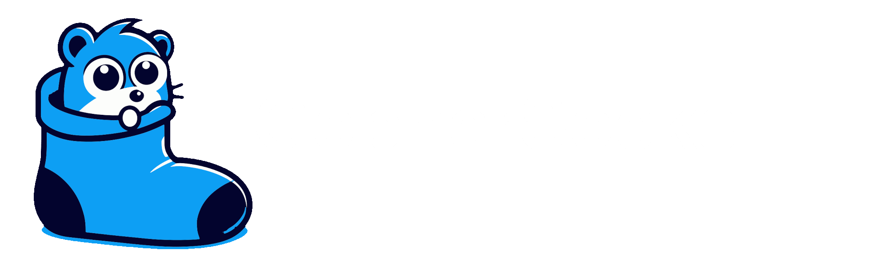

GopherSocks is a high-performance networking library for Go that provides TCP, UDP, and WebSocket servers with advanced session management capabilities. It's designed for building robust network applications with support for multiple protocols and efficient connection handling.

## Features

### Protocol Support
- **TCP Server**
  - Length-prefixed message framing
  - Automatic message validation
  - Configurable buffer sizes
  - Built-in connection management

- **UDP Server**
  - Automatic session management
  - Datagram validation
  - Session timeout handling
  - Support for multiple concurrent sessions

- **WebSocket Server**
  - Binary message support
  - Custom endpoint paths
  - Configurable buffer sizes
  - Automatic connection upgrade

### Session Management
- Unique session IDs using UUID v4
- Last received time tracking
- Automatic session cleanup
- Session announcement middleware
- Context-based cancellation
- Clean shutdown handling

### Configuration
- Maximum message length limits
- Configurable buffer sizes
- Read/Write timeouts
- Maximum concurrent connections
- Custom logger support
- Protocol-specific options

### Error Handling
- Protocol-specific error types
- Detailed error messages
- Error cause tracking
- Connection error recovery
- Validation error handling

## Installation

```bash
go get github.com/A13xB0/GopherSocks
```

## Usage Examples

### TCP Server

```go
package main

import (
    "fmt"
    "os"
    "os/signal"
    "syscall"

    gophersocks "github.com/A13xB0/GopherSocks"
)

func main() {
    // Create TCP server
    server, err := gophersocks.NewTCPListener(
        "0.0.0.0",
        8001,
        gophersocks.WithMaxLength(1024*1024), // 1MB max message size
        gophersocks.WithBufferSize(100),      // Channel buffer size
        gophersocks.WithTimeouts(30, 30),     // 30 second timeouts
        gophersocks.WithMaxConnections(1000), // Max connections
    )
    if err != nil {
        fmt.Printf("Failed to create server: %v\n", err)
        os.Exit(1)
    }

    // Handle new sessions
    server.SetAnnounceNewSession(func(options any, session gophersocks.Session) {
        fmt.Printf("New connection from %v\n", session.GetClientAddr())
        
        // Handle session data
        go func() {
            for data := range session.Data() {
                // Echo data back
                if err := session.SendToClient(data); err != nil {
                    fmt.Printf("Send error: %v\n", err)
                    return
                }
            }
        }()
    }, nil)

    // Start server
    if err := server.StartListener(); err != nil {
        fmt.Printf("Failed to start: %v\n", err)
        os.Exit(1)
    }

    // Wait for interrupt
    sig := make(chan os.Signal, 1)
    signal.Notify(sig, syscall.SIGINT, syscall.SIGTERM)
    <-sig

    // Graceful shutdown
    server.StopListener()
}
```

### UDP Server

```go
package main

import (
    "fmt"
    "os"
    "os/signal"
    "syscall"
    "time"

    gophersocks "github.com/A13xB0/GopherSocks"
)

func main() {
    // Create UDP server
    server, err := gophersocks.NewUDPListener(
        "0.0.0.0",
        8002,
        gophersocks.WithMaxLength(65507),     // Max UDP datagram
        gophersocks.WithBufferSize(1000),     // Larger buffer for UDP
        gophersocks.WithTimeouts(60, 60),     // 60 second timeouts
        gophersocks.WithMaxConnections(1000), // Max sessions
    )
    if err != nil {
        fmt.Printf("Failed to create server: %v\n", err)
        os.Exit(1)
    }

    // Handle new sessions
    server.SetAnnounceNewSession(func(options any, session gophersocks.Session) {
        fmt.Printf("New session from %v\n", session.GetClientAddr())
        
        go func() {
            for data := range session.Data() {
                // Check session timeout
                if time.Since(session.GetLastRecieved()) > time.Minute {
                    session.CloseSession()
                    return
                }

                // Echo datagram
                if err := session.SendToClient(data); err != nil {
                    fmt.Printf("Send error: %v\n", err)
                    return
                }
            }
        }()
    }, nil)

    // Start server
    if err := server.StartListener(); err != nil {
        fmt.Printf("Failed to start: %v\n", err)
        os.Exit(1)
    }

    // Wait for interrupt
    sig := make(chan os.Signal, 1)
    signal.Notify(sig, syscall.SIGINT, syscall.SIGTERM)
    <-sig

    // Graceful shutdown
    server.StopListener()
}
```

### WebSocket Server

```go
package main

import (
    "fmt"
    "os"
    "os/signal"
    "syscall"

    gophersocks "github.com/A13xB0/GopherSocks"
)

func main() {
    // Create WebSocket server
    server, err := gophersocks.NewWebSocketListener(
        "0.0.0.0",
        8003,
        gophersocks.WithMaxLength(1024*1024),    // 1MB max message
        gophersocks.WithBufferSize(100),         // Buffer size
        gophersocks.WithTimeouts(30, 30),        // 30 second timeouts
        gophersocks.WithWebSocketBufferSizes(1024, 1024),
        gophersocks.WithWebSocketPath("/ws"),
    )
    if err != nil {
        fmt.Printf("Failed to create server: %v\n", err)
        os.Exit(1)
    }

    // Handle new connections
    server.SetAnnounceNewSession(func(options any, session gophersocks.Session) {
        fmt.Printf("New connection from %v\n", session.GetClientAddr())
        
        go func() {
            for data := range session.Data() {
                // Echo message
                if err := session.SendToClient(data); err != nil {
                    fmt.Printf("Send error: %v\n", err)
                    return
                }
            }
        }()
    }, nil)

    // Start server
    fmt.Printf("WebSocket server listening on ws://0.0.0.0:8003/ws\n")
    if err := server.StartListener(); err != nil {
        fmt.Printf("Failed to start: %v\n", err)
        os.Exit(1)
    }

    // Wait for interrupt
    sig := make(chan os.Signal, 1)
    signal.Notify(sig, syscall.SIGINT, syscall.SIGTERM)
    <-sig

    // Graceful shutdown
    server.StopListener()
}
```

## Configuration Options

### Common Options
```go
// Set maximum message length
WithMaxLength(length uint32)

// Set channel buffer size
WithBufferSize(size int)

// Set read/write timeouts in seconds
WithTimeouts(read, write time.Duration)

// Set maximum concurrent connections
WithMaxConnections(max int)

// Set custom logger
WithLogger(logger Logger)
```

### WebSocket Options
```go
// Set WebSocket buffer sizes
WithWebSocketBufferSizes(readSize, writeSize int)

// Set WebSocket endpoint path
WithWebSocketPath(path string)
```

## Session Interface

The Session interface provides methods for handling network connections:

```go
type Session interface {
    // Get unique session ID
    GetSessionID() string
    
    // Get client's network address
    GetClientAddr() net.Addr
    
    // Get last received time
    GetLastRecieved() time.Time
    
    // Get data channel for receiving messages
    Data() chan []byte
    
    // Send data to client
    SendToClient(data []byte) error
    
    // Close the session
    CloseSession()
}
```

## Error Types

- `ConnectionError`: Network connection issues
- `ConfigError`: Configuration validation errors
- `ProtocolError`: Protocol-specific errors
- `SessionError`: Session management issues

## Examples

See the `example/` directory for complete working examples:
- `example/tcplistener/`: TCP echo server
- `example/udplistener/`: UDP echo server with session timeout
- `example/wslistener/`: WebSocket echo server

## Contributing

Contributions are welcome! Please feel free to submit a Pull Request.
This project is more for me than for you, so I will not be providing support. 

## License

This project is licensed under the GNU General Public License v3.0 - see the [LICENSE](LICENSE) file for details.

Copyright (C) 2025 Alex Bolton

This program is free software: you can redistribute it and/or modify it under the terms of the GNU General Public License as published by the Free Software Foundation, either version 3 of the License, or (at your option) any later version.

This program is distributed in the hope that it will be useful, but WITHOUT ANY WARRANTY; without even the implied warranty of MERCHANTABILITY or FITNESS FOR A PARTICULAR PURPOSE. See the GNU General Public License for more details.

You should have received a copy of the GNU General Public License along with this program. If not, see <https://www.gnu.org/licenses/>.
