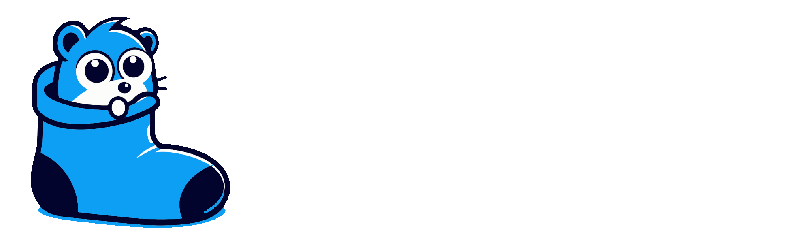

**This is being developed just for fun, no support will be given, not everything will work consistently, the Go code may be shakey**

GopherSocks is a networking library for Go that provides TCP, UDP, WebSocket, and QUIC servers with advanced session management capabilities. It's designed for building robust network applications with support for multiple protocols and efficient connection handling.

## Features

- **Four transports with one session API:** TCP, UDP, WebSocket and QUIC.
- **A goroutine per session.** `Serve(ctx, handler)` runs your handler for each
  session and closes the session when it returns.
- **Backpressure.** `Session.Messages()` reads the next message only when you
  ask for it, so a busy handler slows its client (TCP/QUIC flow control)
  instead of buffering without bound.
- **Non-blocking sends.** `SendToClient` queues to a per-session writer that
  batches frames into one write. A client that stays `SendQueueSize` messages
  behind for `WriteTimeout` is closed as a slow consumer.
- **Framing you can evolve.** QUIC framing is chosen per connection by ALPN,
  so a server can offer a new format and keep serving old clients.
- **Clean lifecycle.** A full server rejects one connection and keeps
  serving; `StopListener` closes every session and waits for its goroutines;
  every session's `Context()` records why it closed.

### Framing

| Transport | Frame |
|---|---|
| QUIC, ALPN `gophersocks` (default) | `payload \| uint16 length \| "\n\n\n"` (`framing.Legacy`, max 65,535 bytes) |
| QUIC, your ALPN | any `framing.Codec`, e.g. `framing.Uvarint`: `uvarint length \| payload` |
| TCP | `uint32 length \| payload` (`framing.Uint32`) |
| UDP | one datagram per message |
| WebSocket | one binary message per message |

The Legacy decoder only accepts a delimiter whose length field matches, so a
payload that contains `\n\n\n` (common in protobuf) no longer stalls the
stream. For new protocol versions prefer `framing.Uvarint`, which has no
delimiter at all.

## Installation

```bash
go get github.com/A13xB0/GopherSocks
```

## Serving sessions

```go
l, err := gophersocks.NewQUICListener("0.0.0.0", 8443,
    gophersocks.WithMaxConnections(1000),
    gophersocks.WithQUICCodec("myproto/2", framing.Uvarint), // offered first; old clients still get "gophersocks"
)
if err != nil {
    return err
}
if err := l.Listen(); err != nil { // bind now; bind errors are returned here
    return err
}
return l.Serve(ctx, func(ctx context.Context, s gophersocks.Session) {
    for msg := range s.Messages() { // pulled: a slow handler slows this client only
        if err := s.SendToClient(msg); err != nil {
            return
        }
    }
    // returning closes the session; context.Cause(s.Context()) says why it ended
})
```

`StartListener` and `SetAnnounceNewSession` still work. The callback runs on
the session's own goroutine and messages are read ahead into `Data()`.

## Usage Examples

### TCP Server (IPv4)

```go
package main

import (
    "fmt"
    "os"
    "os/signal"
    "syscall"
    "time"

    gophersocks "github.com/A13xB0/GopherSocks"
)

func main() {
    // Create TCP server
    server, err := gophersocks.NewTCPListener(
        "0.0.0.0",
        8001,
        gophersocks.WithMaxLength(1024*1024), // 1MB max message size
        gophersocks.WithBufferSize(100),      // Channel buffer size
        gophersocks.WithTimeouts(30*time.Second, 30*time.Second),
        gophersocks.WithMaxConnections(1000), // Max connections
    )
    if err != nil {
        fmt.Printf("Failed to create server: %v\n", err)
        os.Exit(1)
    }

    // Handle new sessions
    server.SetAnnounceNewSession(func(options any, session gophersocks.Session) {
        fmt.Printf("New connection from %v\n", session.GetClientAddr())
        
        // Handle session data
        go func() {
            for data := range session.Data() {
                // Echo data back
                if err := session.SendToClient(data); err != nil {
                    fmt.Printf("Send error: %v\n", err)
                    return
                }
            }
        }()
    }, nil)

    // Start server
    if err := server.StartListener(); err != nil {
        fmt.Printf("Failed to start: %v\n", err)
        os.Exit(1)
    }

    // Wait for interrupt
    sig := make(chan os.Signal, 1)
    signal.Notify(sig, syscall.SIGINT, syscall.SIGTERM)
    <-sig

    // Graceful shutdown
    server.StopListener()
}
```

### TCP Server (IPv6)

```go
package main

import (
    "fmt"
    "os"
    "os/signal"
    "syscall"
    "time"

    gophersocks "github.com/A13xB0/GopherSocks"
)

func main() {
    // Create TCP server with IPv6
    server, err := gophersocks.NewTCPListener(
        "[::1]", // IPv6 loopback address
        8001,
        gophersocks.WithMaxLength(1024*1024),
        gophersocks.WithBufferSize(100),
        gophersocks.WithTimeouts(30*time.Second, 30*time.Second),
        gophersocks.WithMaxConnections(1000),
    )
    if err != nil {
        fmt.Printf("Failed to create server: %v\n", err)
        os.Exit(1)
    }

    // Handle new sessions
    server.SetAnnounceNewSession(func(options any, session gophersocks.Session) {
        fmt.Printf("New IPv6 connection from %v\n", session.GetClientAddr())
        
        go func() {
            for data := range session.Data() {
                if err := session.SendToClient(data); err != nil {
                    fmt.Printf("Send error: %v\n", err)
                    return
                }
            }
        }()
    }, nil)

    // Start server
    if err := server.StartListener(); err != nil {
        fmt.Printf("Failed to start: %v\n", err)
        os.Exit(1)
    }

    // Wait for interrupt
    sig := make(chan os.Signal, 1)
    signal.Notify(sig, syscall.SIGINT, syscall.SIGTERM)
    <-sig

    // Graceful shutdown
    server.StopListener()
}
```

### TCP Server (Dual Stack)

```go
package main

import (
    "fmt"
    "os"
    "os/signal"
    "syscall"
    "time"

    gophersocks "github.com/A13xB0/GopherSocks"
)

func main() {
    // Create dual-stack TCP server
    server, err := gophersocks.NewTCPListener(
        "::", // Bind to all interfaces (IPv4 and IPv6)
        8001,
        gophersocks.WithMaxLength(1024*1024),
        gophersocks.WithBufferSize(100),
        gophersocks.WithTimeouts(30*time.Second, 30*time.Second),
        gophersocks.WithMaxConnections(1000),
    )
    if err != nil {
        fmt.Printf("Failed to create server: %v\n", err)
        os.Exit(1)
    }

    // Handle new sessions
    server.SetAnnounceNewSession(func(options any, session gophersocks.Session) {
        fmt.Printf("New connection from %v\n", session.GetClientAddr())
        
        go func() {
            for data := range session.Data() {
                if err := session.SendToClient(data); err != nil {
                    fmt.Printf("Send error: %v\n", err)
                    return
                }
            }
        }()
    }, nil)

    fmt.Println("Dual-stack TCP server listening on [::]:8001")
    fmt.Println("IPv4: 0.0.0.0:8001")
    fmt.Println("IPv6: [::]:8001")

    // Start server
    if err := server.StartListener(); err != nil {
        fmt.Printf("Failed to start: %v\n", err)
        os.Exit(1)
    }

    // Wait for interrupt
    sig := make(chan os.Signal, 1)
    signal.Notify(sig, syscall.SIGINT, syscall.SIGTERM)
    <-sig

    // Graceful shutdown
    server.StopListener()
}
```

### UDP Server

```go
package main

import (
    "fmt"
    "os"
    "os/signal"
    "syscall"
    "time"

    gophersocks "github.com/A13xB0/GopherSocks"
)

func main() {
    // Create UDP server
    server, err := gophersocks.NewUDPListener(
        "0.0.0.0",
        8002,
        gophersocks.WithMaxLength(65507),     // Max UDP datagram
        gophersocks.WithBufferSize(1000),     // Larger buffer for UDP
        gophersocks.WithTimeouts(60*time.Second, 60*time.Second),
        gophersocks.WithMaxConnections(1000), // Max sessions
    )
    if err != nil {
        fmt.Printf("Failed to create server: %v\n", err)
        os.Exit(1)
    }

    // Handle new sessions
    server.SetAnnounceNewSession(func(options any, session gophersocks.Session) {
        fmt.Printf("New session from %v\n", session.GetClientAddr())
        
        go func() {
            for data := range session.Data() {
                // Check session timeout
                if time.Since(session.GetLastRecieved()) > time.Minute {
                    session.CloseSession()
                    return
                }

                // Echo datagram
                if err := session.SendToClient(data); err != nil {
                    fmt.Printf("Send error: %v\n", err)
                    return
                }
            }
        }()
    }, nil)

    // Start server
    if err := server.StartListener(); err != nil {
        fmt.Printf("Failed to start: %v\n", err)
        os.Exit(1)
    }

    // Wait for interrupt
    sig := make(chan os.Signal, 1)
    signal.Notify(sig, syscall.SIGINT, syscall.SIGTERM)
    <-sig

    // Graceful shutdown
    server.StopListener()
}
```

### QUIC Server

```go
package main

import (
    "fmt"
    "os"
    "os/signal"
    "syscall"
    "time"

    gophersocks "github.com/A13xB0/GopherSocks"
)

func main() {
    // Create QUIC server (auto-generates TLS certificate)
    server, err := gophersocks.NewQUICListener(
        "0.0.0.0",
        8004,
        gophersocks.WithMaxLength(10000),      // Max message size
        gophersocks.WithBufferSize(100),       // Stream buffer size
        gophersocks.WithTimeouts(30*time.Second, 30*time.Second),
        gophersocks.WithMaxConnections(1000),  // Max concurrent streams
    )
    if err != nil {
        fmt.Printf("Failed to create server: %v\n", err)
        os.Exit(1)
    }

    // Handle new streams
    server.SetAnnounceNewSession(func(options any, session gophersocks.Session) {
        fmt.Printf("New QUIC stream from %v\n", session.GetClientAddr())
        
        go func() {
            for data := range session.Data() {
                // Echo message back on stream
                if err := session.SendToClient(data); err != nil {
                    fmt.Printf("Send error: %v\n", err)
                    return
                }
            }
        }()
    }, nil)

    // Start server
    fmt.Printf("QUIC server listening on quic://0.0.0.0:8004\n")
    if err := server.StartListener(); err != nil {
        fmt.Printf("Failed to start: %v\n", err)
        os.Exit(1)
    }

    // Wait for interrupt
    sig := make(chan os.Signal, 1)
    signal.Notify(sig, syscall.SIGINT, syscall.SIGTERM)
    <-sig

    // Graceful shutdown
    server.StopListener()
}
```

### WebSocket Server

```go
package main

import (
    "fmt"
    "os"
    "os/signal"
    "syscall"
    "time"

    gophersocks "github.com/A13xB0/GopherSocks"
)

func main() {
    // Create WebSocket server
    server, err := gophersocks.NewWebSocketListener(
        "0.0.0.0",
        8003,
        gophersocks.WithMaxLength(1024*1024),    // 1MB max message
        gophersocks.WithBufferSize(100),         // Buffer size
        gophersocks.WithTimeouts(30*time.Second, 30*time.Second),
        gophersocks.WithWebSocketBufferSizes(1024, 1024),
        gophersocks.WithWebSocketPath("/ws"),
    )
    if err != nil {
        fmt.Printf("Failed to create server: %v\n", err)
        os.Exit(1)
    }

    // Handle new connections
    server.SetAnnounceNewSession(func(options any, session gophersocks.Session) {
        fmt.Printf("New connection from %v\n", session.GetClientAddr())
        
        go func() {
            for data := range session.Data() {
                // Echo message
                if err := session.SendToClient(data); err != nil {
                    fmt.Printf("Send error: %v\n", err)
                    return
                }
            }
        }()
    }, nil)

    // Start server
    fmt.Printf("WebSocket server listening on ws://0.0.0.0:8003/ws\n")
    if err := server.StartListener(); err != nil {
        fmt.Printf("Failed to start: %v\n", err)
        os.Exit(1)
    }

    // Wait for interrupt
    sig := make(chan os.Signal, 1)
    signal.Notify(sig, syscall.SIGINT, syscall.SIGTERM)
    <-sig

    // Graceful shutdown
    server.StopListener()
}
```

## Configuration Options

### Common Options
```go
WithMaxLength(length uint32)            // largest message, default 1 MB
WithBufferSize(size int)                // capacity of Session.Data()
WithSendQueueSize(size int)             // outbound messages buffered per session, default 1024
WithTimeouts(read, write time.Duration) // idle timeout (TCP, WebSocket, UDP sessions) and write timeout
WithMaxConnections(max int)             // concurrent sessions; extra connections are rejected
WithLogger(logger listener.Logger)      // listener.NewSlogLogger(slog.Default()) adapts slog
```

### WebSocket Options
```go
WithWebSocketBufferSizes(readSize, writeSize int)
WithWebSocketPath(path string)
WithWebSocketCheckOrigin(fn func(*http.Request) bool) // default: any origin
```

### QUIC Options
```go
WithTLSConfig(config *tls.Config)                // default: ephemeral self-signed ECDSA cert (development)
WithQUICConfig(config *quic.Config)
WithQUICCodec(alpn string, codec framing.Codec)  // offer another framing, preferred over earlier ones
listener.WithQUICDelimiter(delimiter []byte)     // Legacy framing delimiter, default "\n\n\n"
```

### Client Options
```go
WithDelimiter(delimiter []byte)
WithClientTimeouts(read, write time.Duration)
WithClientBufferSize(size int)
WithClientMaxLength(n int)
WithQUICInsecureSkipVerify(skip bool)
WithQUICNextProtos(protos []string)
WithQUICMinVersion(version uint16)
WithClientQUICCodec(alpn string, codec framing.Codec)
```

## Session Interface

```go
type Session interface {
    SendToClient(data []byte) error // queued; don't modify data afterwards
    Messages() iter.Seq[[]byte]      // pull-based reads (use this or Data, not both)
    Data() chan []byte               // read-ahead channel, closed when the session ends
    CloseSession()
    Context() context.Context       // ends on close; context.Cause says why
    GetSessionID() string
    GetClientAddr() net.Addr
    GetLastRecieved() time.Time
}
```

Close causes: `ErrSessionClosed`, `ErrSlowConsumer`, `ErrServerStopped`, or
the read/write error that ended the connection.

## Error Types

- `ConnectionError`: Network connection issues
- `ConfigError`: Configuration validation errors
- `ProtocolError`: Protocol-specific errors
- `SessionError`: Session management issues

## Examples

See the `example/` directory for complete working examples:
- `example/tcplistener/`: TCP echo server
- `example/udplistener/`: UDP echo server with session timeout
- `example/wslistener/`: WebSocket echo server
- `example/quiclistener/`: QUIC echo server with TLS
- `example/quicclient/`: QUIC client example

## Contributing

Contributions are welcome! Please feel free to submit a Pull Request.
This project is more for me than for you, so I will not be providing support. 

## License

This project is licensed under the GNU General Public License v3.0 - see the [LICENSE](LICENSE) file for details.

Copyright (C) 2025 Alex Bolton

This program is free software: you can redistribute it and/or modify it under the terms of the GNU General Public License as published by the Free Software Foundation, either version 3 of the License, or (at your option) any later version.

This program is distributed in the hope that it will be useful, but WITHOUT ANY WARRANTY; without even the implied warranty of MERCHANTABILITY or FITNESS FOR A PARTICULAR PURPOSE. See the GNU General Public License for more details.

You should have received a copy of the GNU General Public License along with this program. If not, see <https://www.gnu.org/licenses/>.
